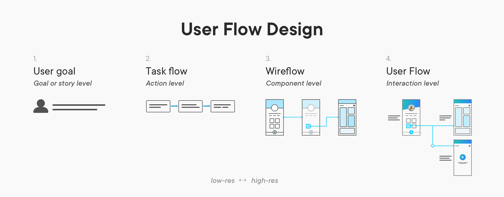
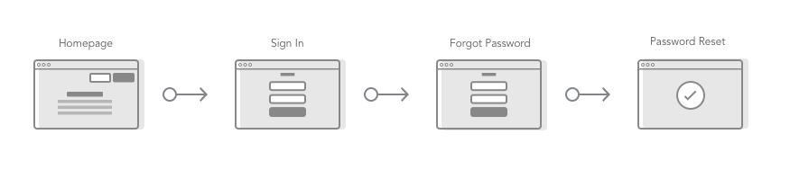
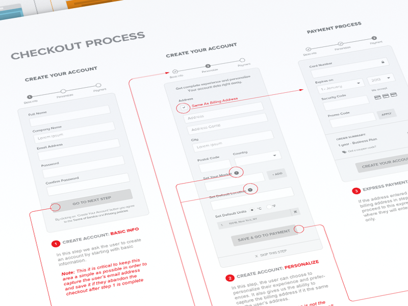
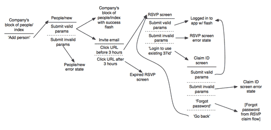

# 资料


[什么时候使用用户流设计](https://uxdesign.cc/when-to-use-user-flows-guide-8b26ca9aa36a)



[任务流，用户流，流程图以及其它全新术语](https://uxplanet.org/ux-glossary-task-flows-user-flows-flowcharts-and-some-new-ish-stuff-2321044d837d)

Userflows



Wireflows

 - Entries and Exits
 - Steps. Ex: user action, system action, alternative path
 - Connections: Indicate the desired path and different possible flows
 - Decision Points: a point where a user must choose from 2 or more options



Task flows


## Old

[A shorthand for designing UI flows](https://signalvnoise.com/posts/1926-a-shorthand-for-designing-ui-flows)



 - See
 - Do
 
```
 
What the            What the
user sees           see Next
---------     =>    ---------
What the            What They 
DO                  Do  Next
 
````